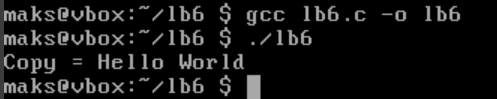
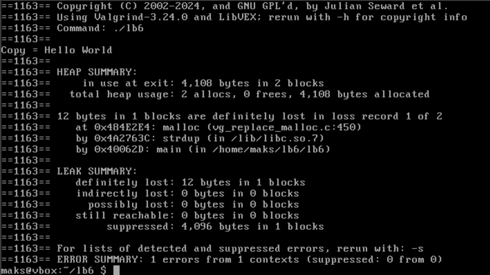
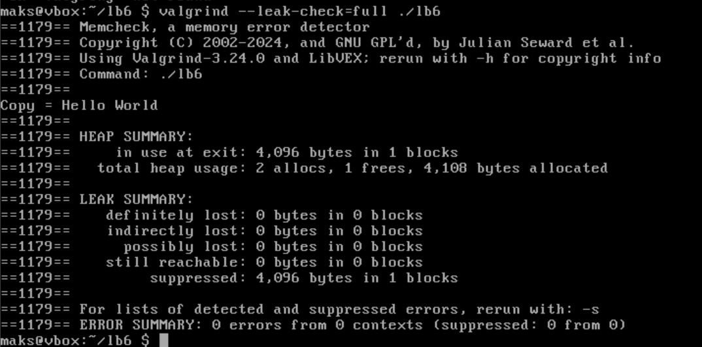

# Практична 6

## Варіант 10

Створіть витік пам’яті, викликавши функцію з бібліотеки, яка виділяє памʼять (наприклад, strdup) і не звільняється.

---

Написав наступний [код](lb6.c), в якому використав ```strdup()``` для того щоб виділити пам'ять.
```c
int main(){
	char *original = "Hello World";
	char *copy = strdup(original);

	if (copy == NULL){
		perror("strdup failed");
		return 1;
	}
	
	printf("Copy = %s\n", copy);

	return 0;
}
```

В цьому коді я ніде не використовував ```free()``` щоб трапився витік пам'яті.

Компіляція і стандартний запуск:



Як бачимо, програма просто вивела скопіюване повідомлення. Тепер перевіримо на витік пам'яті за допомогою [Valgrind](https://valgrind.org/docs/manual/quick-start.html) - ```valgrind --leak-check=full```:



Нам показують, що витік відбувся аж на 12 байтів! До речі, тут також написали, що ми використали ```0 frees```. Спробуємо запустити з використаним ```free()``` через той самий Valgrind:



Тепер витоку немає і нам повідомляють про використання однієї ```1 frees``` функції.